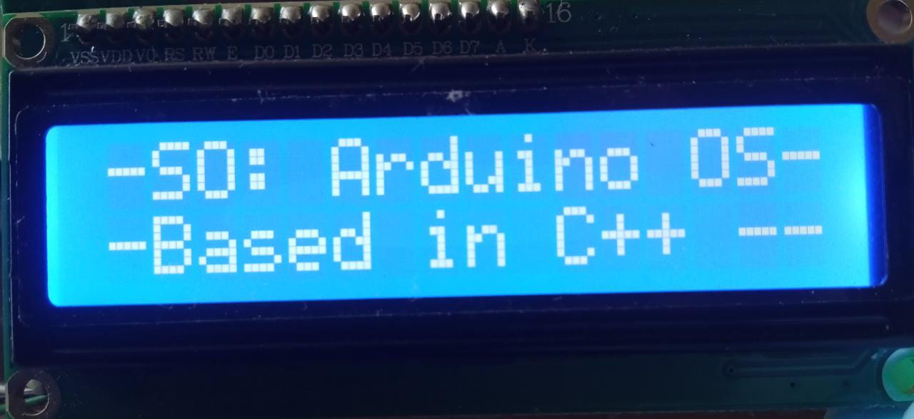

# Arduino Operative System (AROPSY)
This is a little operative system that I do from scratch to practice my Arduino abilities
- - -
## Software needed
- Arduino IDLE
- LiquidCrystal I2C Library
- Android app
    - App I make for this project [here](https://github.com/AvFl4028/AROPSY_android_app) (In progress)
    - Could be a generic bluetooth arduino app
## Hardware needed
- Arduino UNO
- LCD 16 x 2
- Module I2C
- Module Bluetooth HC-06
- Servo Motor (Optional)

## Pins Connections
- LCD(I2C)
    | Pins I2C  | Pins Arduino |
    |---|---|
    | SDA  | A4  |
    | SCL  | A5  |
- Module Bluetooth
    | Pins  | Pins Arduino (Digitals)|
    |---|---|
    | TXD  | 2  |
    | RXD  | 3  |
- Servo-Motor (Optional)
    | Pins  | Pins Arduino (Digitals)|
    |---|---|
    | Data (Yellow wire)  | 6  |
- - -
## Images
